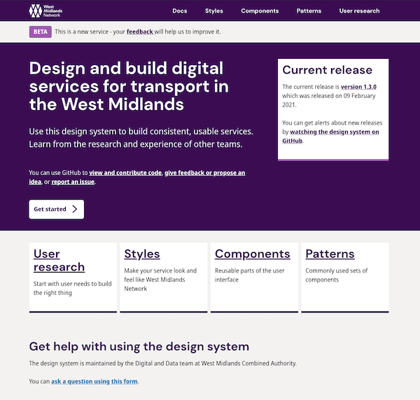

# WMCA Website Redevelopment

## Table of Contents

- [Quick Start](#quick-start)
- [Usage](#usage)
- [Support](#support)
- [Contributing](#contributing)

## WMN Styleguide [](https://app.netlify.com/sites/wmca/deploys)

Welcome to the [West Midlands Network Design System](https://wmnetwork.netlify.com/).

- Tailored for building West Midlands Network apps and websites: Using the WMN Design System markup and CSS framework results in UIs that reflect the West Midlands Network look and feel.
- Continuously updated: As long as you’re using the latest version of the WMN Design System, your pages are always up to date with Salesforce UI changes.

## Quick start

1. Clone the project with `git clone git@bitbucket.org:wmca/west-midlands-network.git`
2. Run `npm install` in the root folder.
3. Run `npm start` to launch the dev enviornment with hot reloading.
4. Visit http://localhost:3000

Having trouble getting these steps to work on your machine? Follow the [troubleshooting guide](guidelines/TROUBLESHOOTING.md).

## WMN Styleguide



The WMN Styleguide is ran at the designated url on startup (usually http://localhost:3000) and is the primary means of viewing your work - it will live update as you make changes.

You can choose the blueprint, variant, and modifiers to preview as well as background color and screen size. It also previews the sass docs.

Everything in the design system is driven by [annotations](guidelines/ANNOTATIONS.md) and the previewer is no different. **To see any work in the previewer, you must add annotations to your code.**

## Annotations

See the <a href="guidelines/ANNOTATIONS.md">annotations guide</a>.

## Tasks

For more in-depth information on what each task does, see [tasks guide](doc/tasks.md).

### `npm start`

Start the WMN Design System web server.

### `npm run lint`

Lint the code base for syntax and stylistic errors.

```bash
# Lint indentation, Sass, JavaScript files, html
npm run lint:all

# Lint languages independently
npm run lint:styles
npm run lint:templates
npm run lint:scripts
```

### Compilation

Build the styleguide for various enviornments

```bash
# Build Sass, JavaScript, HTML files
npm run build:all
npm run buid:staging
npm run build:live

# Build languages/assets independently
npm run build:styles
npm run build:templates
npm run build:scripts
npm run build:images
npm run build:config
```

### Clean up

Delete all built languages/assets
`npm run clean`

Also delete temporary build and local files.

## Troubleshooting

See the [troubleshooting guide](doc/TROUBLESHOOTING.md)</a>.

## Contributing to the code base

See the <a href="CONTRIBUTING.md">contributing guide</a>.

## Got feedback?

Please open a new [Bitbucket Issue](https://bitbucket.org/wmca/west-midlands-network/issues?status=new&status=open)</>.
